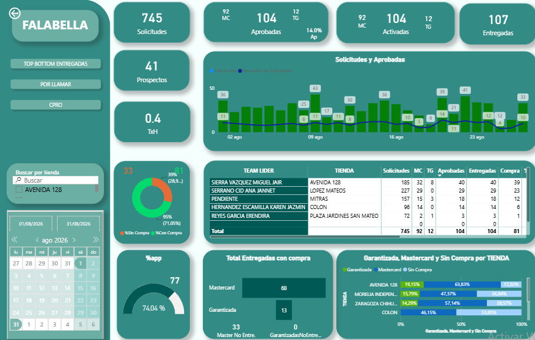
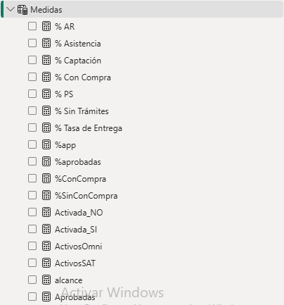

# Visor de Métricas FALABELLA

## Business Intelligence & Data Analytics

**Visor de Métricas FALABELLA** es una solución desarrollada para la visualización y análisis de indicadores mediante un dashboard interactivo.

El proyecto tiene como objetivo transformar información operativa y comercial en indicadores visuales que faciliten la consulta, exploración y seguimiento de métricas.

---

## Dashboard

El proyecto presenta información mediante un visor interactivo diseñado para facilitar la consulta de métricas y el análisis de resultados.

### Vista principal



> Las imágenes mostradas en este repositorio representan capturas del sistema y se utilizan con fines de demostración y portafolio.

---

## Objetivo del proyecto

Desarrollar una herramienta de Business Intelligence que permita centralizar y visualizar diferentes métricas en un entorno interactivo.

La solución busca facilitar:

* Consulta de indicadores.
* Seguimiento de métricas.
* Análisis de información.
* Comparación de resultados.
* Identificación de tendencias.
* Exploración mediante filtros y segmentadores.

---

## Principales características

### Visualización de métricas

Presentación de indicadores mediante tarjetas, gráficos y elementos visuales que permiten interpretar rápidamente la información.

### Filtros interactivos

La información puede explorarse utilizando diferentes criterios disponibles dentro del visor.

### Análisis

El dashboard permite analizar la información desde diferentes perspectivas para facilitar la interpretación de resultados.

### Diseño orientado a negocio

La interfaz está enfocada en presentar información relevante de forma clara y accesible para usuarios que necesitan consultar indicadores.

---

## Tecnologías

| Tecnología      | Uso                                     |
| --------------- | --------------------------------------- |
| **Power BI**    | Visualización y análisis de información |
| **DAX**         | Creación de medidas e indicadores       |
| **Power Query** | Transformación y preparación de datos   |
| **Excel**       | Fuente y preparación de información     |
| **Git**         | Control de versiones                    |
| **GitHub**      | Documentación y portafolio              |

---

## Flujo de trabajo

```text
                 DATOS
                   │
                   ▼
            Power Query
                   │
                   ▼
        Limpieza y transformación
                   │
                   ▼
             Modelo de datos
                   │
                   ▼
                 DAX
                   │
                   ▼
        Métricas e indicadores
                   │
                   ▼
             Power BI
                   │
                   ▼
          VISOR DE MÉTRICAS
```

---

## Indicadores

El visor está diseñado para presentar diferentes métricas de manera centralizada.

Entre los elementos de análisis se pueden incluir:

* KPIs
* Indicadores operativos
* Indicadores comerciales
* Tendencias
* Comparaciones
* Distribuciones
* Métricas por diferentes dimensiones

---

## Documentación

La documentación técnica del proyecto se organizará de la siguiente manera:

### DAX

`DAX/`

Contendrá las principales medidas utilizadas para generar los indicadores.

La documentación podrá incluir:

* Nombre de la medida
* Fórmula
* Descripción
* Objetivo
* Resultado esperado



### Power Query

`PowerQuery/`

Contendrá información relacionada con los procesos de:

* Extracción
* Limpieza
* Transformación
* Tipificación de datos
* Preparación de tablas

### Data

`Data/`

Esta carpeta estará destinada a datos de ejemplo o información utilizada para documentar el proyecto, evitando publicar información confidencial.

---

## Estructura del repositorio

```text
Visor_de_metricas_FALABELLA/
│
├── Screenshots/
│   ├── dashboard.png
│   ├── filtros.png
│   └── ...
│
├── DAX/
│   ├── medidas.md
│   └── ...
│
├── PowerQuery/
│   ├── transformaciones.md
│   └── ...
│
├── Data/
│   └── ...
│
├── README.md
└── .gitignore
```

---

## Enfoque de Data Analytics

El proyecto busca demostrar el proceso completo de una solución de Business Intelligence:

**Data Preparation → Data Transformation → Data Modeling → DAX → Data Visualization → Business Insights**

La intención no es únicamente mostrar un dashboard, sino documentar el proceso utilizado para convertir datos en información útil para el análisis.

---

## Resultados

El resultado es un visor de métricas interactivo que permite consultar información de manera centralizada y explorar diferentes indicadores mediante elementos visuales y filtros.

Las capturas incluidas en este repositorio permiten visualizar el resultado final sin necesidad de publicar el archivo completo utilizado para construir la solución.

---

## Portafolio

Este proyecto forma parte del portafolio de:

**Vicente Quiroz Meneses**

**Data Analyst | Business Intelligence**

### Skills

* Power BI
* DAX
* Power Query
* Data Modeling
* Data Visualization
* Excel
* SQL
* Git
* GitHub

---

## Nota

Este repositorio tiene fines de **portafolio y demostración técnica**.

Las capturas, datos y documentación publicados deben excluir información confidencial, datos personales o información propietaria de la organización.
